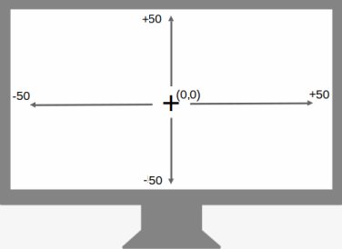

# Custom OSD (GNOME 4X Extension)  


A GNOME Shell extension allowing the user to set the position, orientation, size, color, shadow, transparency and delay of the OSD pop-ups. It can also display % level value for OSDs with levels like Volume/Brightness etc. You can choose to display the OSD on Primary/ External or both the monitors and select what components to show. In summary, fully transform the OSD pop-ups to match your theme and liking!


## Installation

### Recommended

[](https://extensions.gnome.org/extension/6142/custom-osd/)

It's recommended to install the extension from
[extensions website](https://extensions.gnome.org/extension/6142/custom-osd/), or from
the _Extension Manager_ app.


### How to manually install the extension (if needed)?

```
git clone https://github.com/neuromorph/custom-osd.git \
	~/.local/share/gnome-shell/extensions/custom-osd@neuromorph
```
OR download the release zip file (may not be latest) and unzip at location: ~/.local/share/gnome-shell/extensions/

You may need to restart the gnome shell environnment (for manual install):

- logout and login again (Do this if using Wayland) _or_
- `alt+f2` then type `r` and `enter` 

## Settings
Use the settings panel of the extension for most common customizations:  


* Position on Screen 
* Vertical/Horizontal Orientation
* Size 
* Hide-Delay time
* Color and Background
* Box Shadow On/Off
* Box Border On/Off
* Transparency
* Shape Shift: Pill/Rectangle/Other (interpolation)
* Numeric % for levels
* Monitor to show OSD on
* Select what to show: Icon, Text, Level Bar, Numeric %


## Optional Advanced Styling
For optional styling of advanced css options or things like fonts or custom box-shadow effect that is not in settings, you will need to edit "spreadsheet.css" file at -  
~/.local/share/gnome-shell/extensions/custom-osd@neuromorph/  
 After editing the file, you need to lock the screen and unlock again for the changes to take effect. Alternately, you can disable and enable the extension.  
 This allows for some esoteric tinkering for the ones so inclined. 

Example code:
```
.osd-style {
    font-family: Josefin Sans;
    box-shadow: 1px 1px 5px grey;
}
```


## What's New (recent first)
- Some refactor, button to reset settings to default, foreground trasparency option integrated in color, shape shift, fix defaults.
- Select any combinations of OSD components to display. New test-OSD for instant feedback when changing settings. Refactor to preset OSDs with customization and minimize runtime adaptation.
- Improved positioning logic to snap fit edges
- Improved efficiency and compatibility
- Added support for Numeric level %, Monitors to display OSD and Box Border
- Added support for Color+BG Color, Shadow and Orientation
- Settings updated to include Color and Transparency options
- Upload initial version to Gnome extensions store
- Metadata updated for Gnome 44
- Ported for GNOME 42 + some fixes


## Screenshots


## Acknowledgements

- This extension started from [Better OSD](https://extensions.gnome.org/extension/1345/better-osd/) and its Gnome 40 [update](https://extensions.gnome.org/extension/4231/better-osd-gnome-40/). Better OSD became obsolete and forked versions also do not support new OSD modifications in GNOME shell after GNOME 41+. Custom-OSD began with porting the old extension to new GNOME mods so I could continue to use it locally. Eventually, I decided to put it out in case it is helpful to others as well. It soon found many users and many new feature requests as well, so I ended up rewriting the entire code for refinements/bug-fix/refactor and many new features. Nevertheless, Better OSD served as the inspiration and starter code and was an OSD lifesaver back in the days, many thanks to them!
- Also thanks to users who appreciated the project, raised issues and requested new features here and on Gnome Extensions website. In particualr, [RedBearAK](https://github.com/RedBearAK) thoroughly reviewed the extension revisions and suggested [many ideas](https://github.com/neuromorph/custom-osd/issues/3) (most have been incorporated). Much appreciated!

